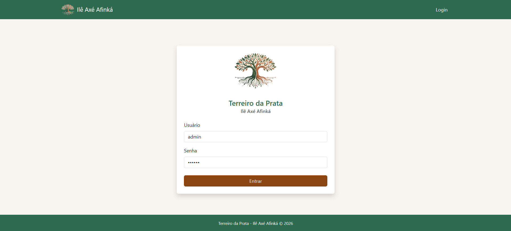
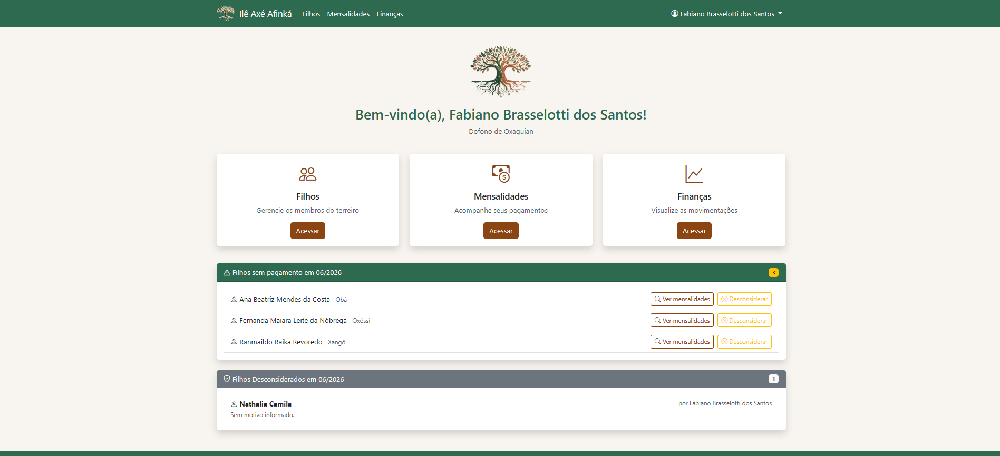
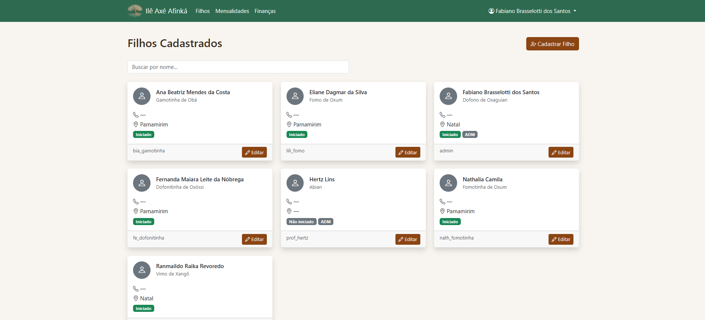
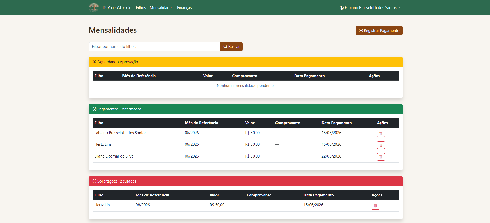
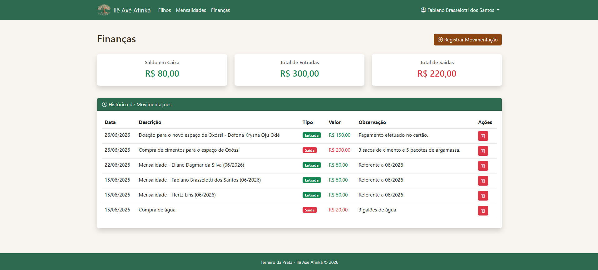

# Osé no Axé

<p align="center">
  
</p>

## Identificação

> Fabiano Brasselotti dos Santos
>
> 20230030400
>
> DCO3012 - Programação Avançada - T01
>
> Título: Osé no Axé


## Introdução 

Os Terreiros de Candomblé são espaços/templos onde para além das demandas espirituais, se faz necessária uma gestão administrativa de pessoas e recursos, buscando garantir uma melhor convivência e organização entre os membros.

O Terreiro da Prata (Ilê Axé Afinká), tomado como referência para desenvolvimento deste projeto, está situado no município de Macaíba-RN, no qual o autor deste trabalho é um membro ativo.

Considerando a vivência no espaço, pôde-se notar problemas como: desconhecimento de informações sobre os filhos da casa, ineficiência tecnológica para o controle de pagamentos, que gera retrabalhos contínuos, falta de transparência financeira, dentre outros.

## Descrição geral

Uma aplicação web desenvolvida em Django que busca organizar demandas administrativas dentro de terreiros de candomblé.

O sistema oferece interfaces para gerir o cadastro de pessoas no banco de dados, os registros de pagamentos de mensalidades, e movimentações financeiras com os seguinter objetivos:  
•	Aumentar o conhecimento sobre os membros afiliados, com o cadastramento em um banco de dados;  
•	Possibilitar uma maior adesão financeira no pagamento das mensalidades através da clareza nas movimentações;  
•	Permitir um maior foco nas demandas espirituais, evitando retrabalhos administrativos.

Não pretendemos tornar o "Osé no Axé" em uma rede social, onde os membros interajam entre si, nem uma plataforma para realizar os pagamentos, como um banco digital.

## Público-alvo & Personas

O "Osé no Axé" foi pensado para a utilização na comunidade de membros de terreiros de candomblé. 

Há dois tipos de perfil: **ADM**, com acesso integral às funcionalidades; e **Filho**, com acesso restrito ao próprio cadastro e ao registro de pagamento mensal via envio de comprovante.

## Estórias do Usuário

| ID | Estória | Objetivo |
|---|---|---|
| EU1 | Como ADM, desejo cadastrar um novo afiliado ou ADM; | Incluir um novo filho à base de dados do terreiro |
| EU2 | Como ADM, quero alterar dados do cadastro de um filho; | Manter as informações pessoais de cada filho atualizadas. |
| EU3 | Como FILHO, quero atualizar os dados do meu cadastro; | Manter as minhas informações pessoais atualizadas. |
| EU4 | Como FILHO, desejo solicitar a baixa do pagamento de mensalidade, enviando um comprovante; | Comprovar a adimplência com as obrigações de mensalidade. |
| EU5 | Como ADM, desejo analisar a solicitação de baixa do pagamento de mensalidade; | Registrar ciência sobre o pagamento, podendo atualizar os relatórios. |
| EU6 | Como ADM, quero saber a situação dos filhos com o pagamento mensal; | Tomar ciência sobre a quantidade de filhos, permitindo fazer estimativas e cobranças aos inadimplentes. |
| EU7 | Como FILHO, quero saber se estou em dia com o pagamento da mensalidade; | Tomar ciência sobre o estado atual de regularidade com a obrigação da mensalidade. |
| EU8 | Como ADM, desejo registrar uma nova movimentação (despesas de custo, doações, mensalidades); | Manter o extrato financeiro fidedigno. |
| EU9 | Como ADM ou FILHO, quero visualizar o saldo em caixa e as movimentações financeiras do terreiro; | Tomar ciência sobre a necessidade do compromisso com os pagamentos de mensalidade. |

## Mapa do site

```text
/                        → redireciona para /login/
/login/                  → pública
/logout/                 → encerra sessão
/home/                   → protegida — dashboard principal
/filhos/                 → somente ADM
│  ├── /filhos/cadastrar/
│  └── /filhos/<pk>/editar/
│  └── /filhos/<pk>/excluir/
/mensalidades/           → todos os usuários logados
│  └── /mensalidades/registrar/
│  ├── /mensalidades/<pk>/aprovar/   → somente ADM
│  ├── /mensalidades/<pk>/negar/     → somente ADM
│  └── /mensalidades/<pk>/excluir/   → somente ADM
│  └── /mensalidades/isentar/<pk>    → somente ADM
/financeiro/             → todos os usuários logados
│  ├── /financeiro/registrar/        → somente ADM
│  └── /financeiro/<pk>/excluir/     → somente ADM
/perfil/                 → todos os usuários logados
```

## Wireframes

### Login


### Home


### Filhos


### Mensalidades


### Finanças


## Stack técnica

| Camada | Tecnologia |
|---|---|
| Back-end | Python 3.10 / Django 5.2 |
| Front-end | Bootstrap 5.3 / Bootstrap Icons |
| Banco de dados | PostgreSQL |
| API REST | Django REST Framework + SimpleJWT |
| Arquivos estáticos | WhiteNoise |
| Deploy | Railway |
| Versionamento | GitHub |

## Fontes de dados

Os dados são cadastrados manualmente pelos ADMs diretamente no sistema. Armazenados em banco PostgreSQL provisionado via Railway.

## Documentação técnica

A documentação detalhada de cada funcionalidade está em [`/docs`](docs/index.md).

## Riscos e atenções

- O sistema não realiza validação de CPF; é importante que os ADMs confiram os dados no momento do cadastro;
- Para que os relatórios se mantenham fiéis, os ADMs devem verificar constantemente as solicitações de pagamento pendentes;
- Membros comuns não têm acesso às informações pessoais dos demais membros;
- A exclusão de um filho remove em cascata todas as suas mensalidades — a operação é irreversível;